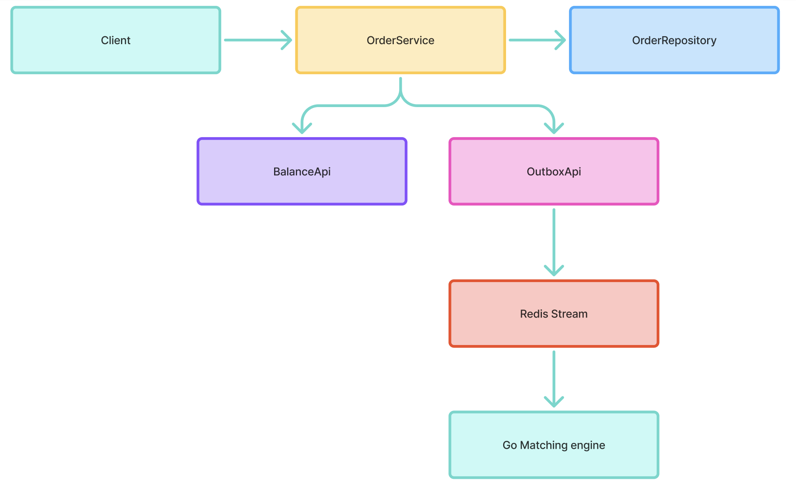
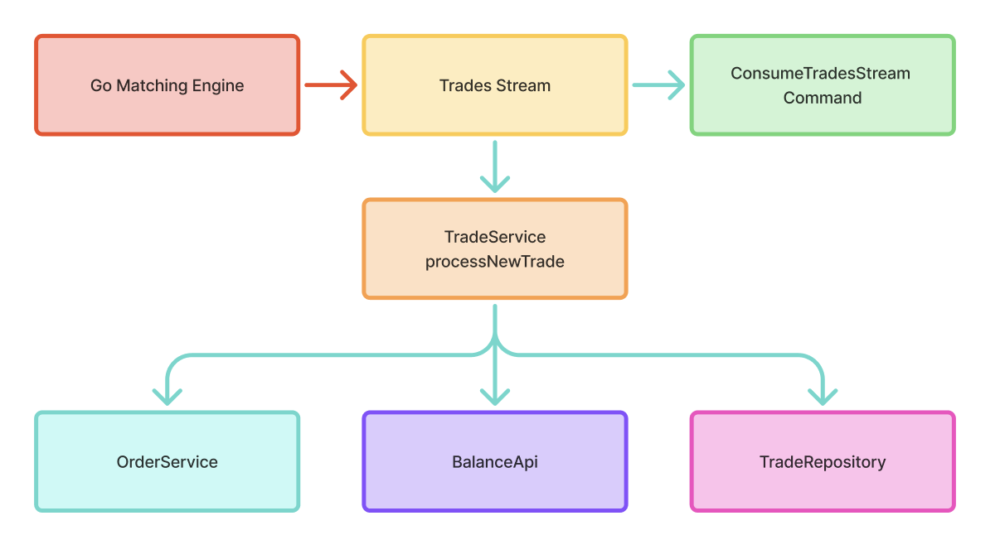
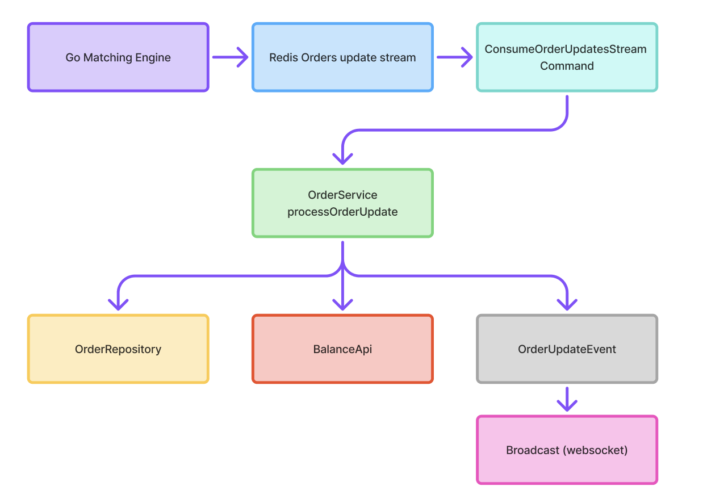

# Data Flow & Event Processing

## Order Lifecycle

## Trade Execution Flow

## Order Update Flow

## Redis Streams

| Stream Name | Producers | Consumers | Purpose |
|-------------|-----------|-----------|---------|
| `matching-stream` | OutboxApi | External services | Order creation events |
| `trades-stream` | - | ConsumeTradesStream | Trade execution events |
| `orders-status-stream` | - | ConsumeOrderUpdatesStream | Order status updates |

## Event Types

| Aggregate | Event Type | Source | Payload |
|-----------|------------|--------|---------|
| Order | `order-created` | OutboxApi | order_id, account_id, side, type, currency, price, amount |
| Order | `order-cancelled` | OrderService | order_id, currency, amount |
| Order | `order-updated` | External | order_id, status, filled_amount |
| Trade | `trade-executed` | External | taker_order_id, maker_order_id, price, amount, base_currency, quote_currency |