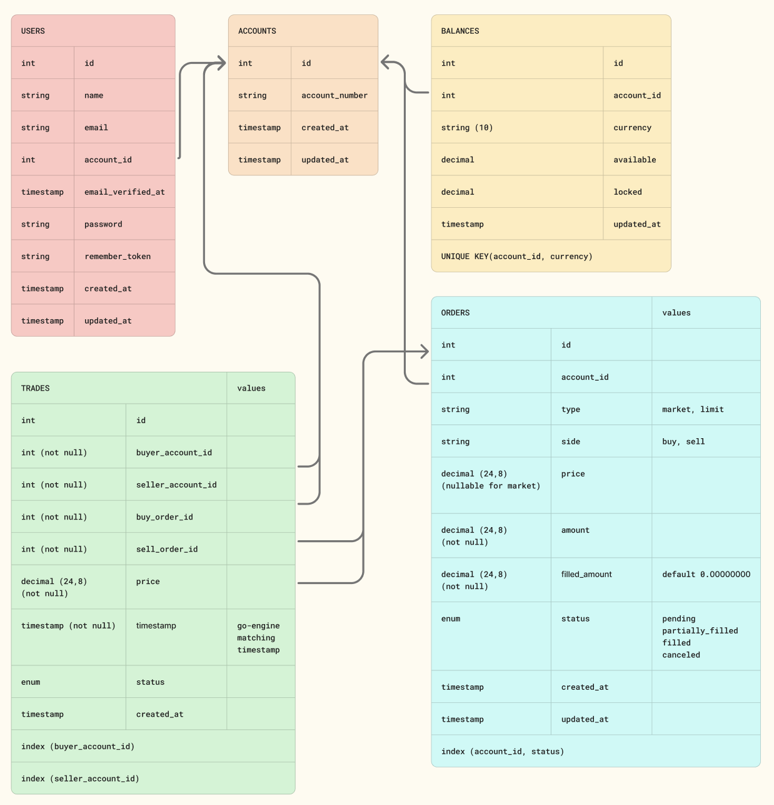
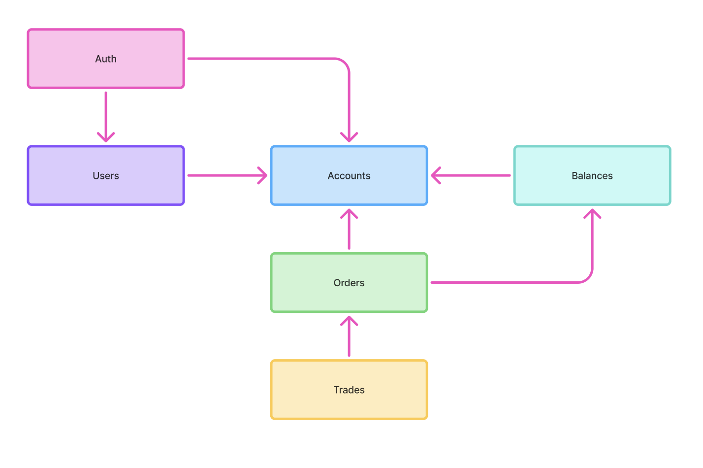

# Domain Model & Module Architecture

## Module Structure

```
app/Modules/
├── Accounts/
│   ├── Domain/
│   │   └── Account.php
│   ├── Infrastructure/
│   │   └── Repositories/
│   ├── Application/
│   │   └── Services/
│   └── Http/Controllers
│
├── Users/
│   ├── Domain/
│   │   └── User.php
│   ├── Application/
│   └── Repository/
│
├── Orders/
│   ├── Domain/
│   │   ├── Order.php
│   │   ├── ActiveOrder.php
│   │   └── Events/
│   ├── Application/
│   │   ├── Services/
│   │   └── DTO/
│   ├── Infrastructure/
│   │   └── Repositories/
│   ├── Http/Controllers
│   ├── Livewire/
│   └── Console/Commands
│
├── Trade/
│   ├── Domain/
│   │   └── Trade.php
│   ├── Application/
│   ├── Infrastructure/
│   └── Console/Commands
│
├── Balances/
│   ├── Domain/
│   │   └── Balance.php
│   ├── Application/
│   ├── Infrastructure/
│   └── PublicApi/
│
├── Orderbook/
│   └── Livewire/
│
└── Shared/
    └── Livewire/
```

## Entity Relationship Diagram



## Module Dependencies

